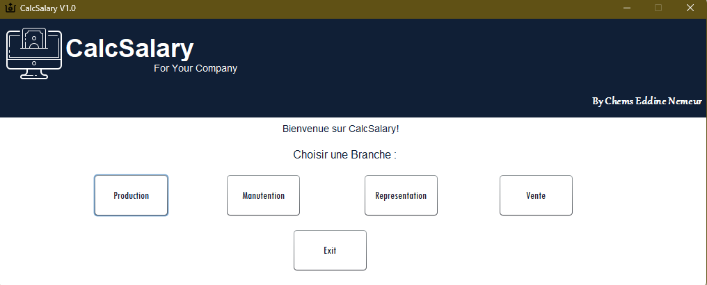
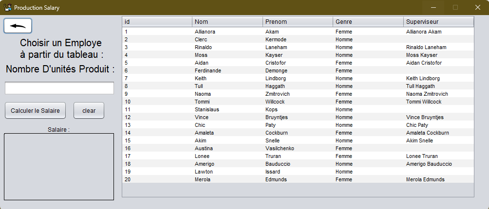
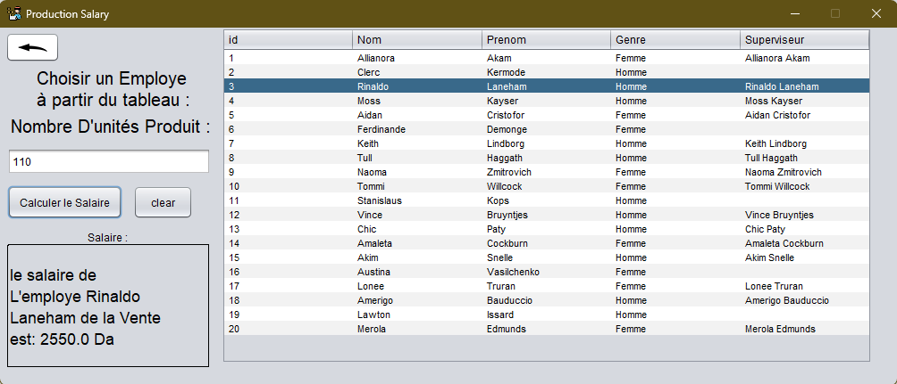

# Salary Calculator

A legacy **Java GUI application** originally created with **NetBeans** in June 2020. This project calculates salaries for employees across various departments using specific business logic for each role.

---

## 🖼️ Screenshots
| Image 1: Dashboard | Image 2: Inside a Class | Image 3: Calculation Result |
| :---: | :---: | :---: |
|  |  |  |

---

## 📂 Database & Data
This project utilizes a local **SQLite database** for persistence:
* **Database File**: `Database.db`.
* **Pre-filled Data**: The database includes **sample data**. You can run the application and see the salary calculations immediately without manually entering records.
* **Driver**: Uses `sqlite-jdbc-3.30.1.jar` to connect the Java frontend to the data.

---

## 🛠️ Project Structure
The application is divided into several department-specific modules:
* **Production / Manutention**: Factory and labor salary logic.
* **Vente / Representation**: Sales and commission-based logic.
* **CalculeSalary**: The central processing module.

---

## 🚀 Libraries Included
* `rs2xml.jar`: Simplifies the process of displaying database results in UI tables.
* `sqlite-jdbc-3.30.1.jar`: The essential driver for SQLite connectivity.